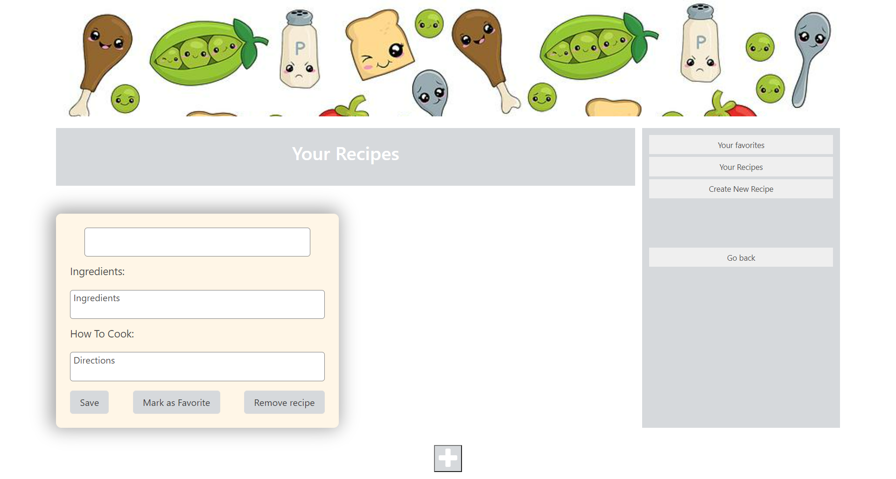

#### Project 1
## To cook, or not too cook?
# User story:
* As a user deciding what to eat, they pull up our webpage.
* When a user is presented with the page, it is populated with suggested recipes and local restaurants through API requests.
* If a user has any Allergies or Dietary restrictions they can select accordingly via a dropdown menu.
* A User has the ability to search for different Recipes or restaurants via the search bar.
* A User can save there favorite recipe via client-side storage in an external HTML page
* A User can input there own recipe in the external HTML page and save it as a favorites
* A user can add, change, or delete anything in they’re favorites recipe.
# Acceptence Criteria
* Use a CSS framework other than Bootstrap.√
* Be deployed to GitHub Pages.√
* Be interactive (i.e., accept and respond to user input).√
* Use at least two [server-side APIs] Spoonacular/ Google Places.√
* Does not use alerts, confirms, or prompts (use modals).√
* Use client-side storage to store persistent data.√
* Be responsive.√
* Have a polished UI.√
* Have a clean repository that meets quality coding standards (file structure, naming conventions, follows best practices for class/id naming conventions, indentation, quality comments, etc.).√
* Have a quality README (with unique name, description, technologies used, screenshot, and link to deployed application).√
[Live website]()
####
[Github Repo]()
####

